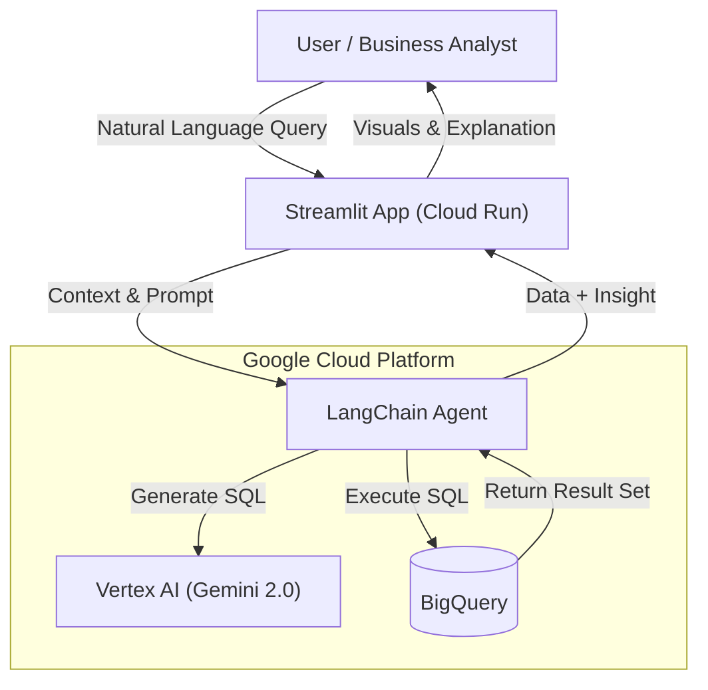

# 🛍️ AI-Powered E-commerce Analyst Agent

[](https://www.python.org/)
[](https://streamlit.io/)
[](https://cloud.google.com/)

## 📖 Project Overview
This project is an **Autonomous AI Agent** designed to analyze Shopify e-commerce data. Unlike traditional dashboards that require manual filtering, this agent utilizes **Generative AI (Gemini 2.0)** to translate natural language questions into complex SQL queries, execute them against a Data Warehouse, and provide actionable business insights.

It solves the problem of "Data Rich, Insight Poor" by allowing non-technical stakeholders to ask questions like *"Why is product X performing poorly?"* and receive data-backed answers immediately.

## 💬 Live Demo & Examples
Below are actual interaction transcripts demonstrating the agent's ability to reason, calculate, and summarize business metrics.

### Scenario 1: Basic Fact Retrieval
> **User:** Which product has the highest total views?
>
> **AI:** Item ID 187946 has the highest total views at 3410.

### Scenario 2: Conversion Analysis
> **User:** What is the conversion rate for the top item?
>
> **AI:** Based on the provided data, the conversion rate for the top item (itemid 187946) is 0%. It has 2 add-to-carts but 0 orders.

### Scenario 3: Complex Reasoning & Diagnosis
> **User:** Summarize the performance of these products.
>
> **AI:** Here's a summary of the top 10 products based on the provided data:
> * **High View Count, Low Conversion:** Several products (187946, 5411, 370653, 298009, 96924) have a relatively high number of views but very few or no add-to-carts or orders, indicating a potential issue with product appeal, pricing, or presentation.
> * **Strong Add-to-Cart to Order Conversion:** Products 461686, 219512, 309778, 257040 and 384302 show a better conversion rate from add-to-carts to orders, suggesting these products are more appealing to customers who are further down the purchase funnel.
> * **Outlier:** Product 461686 stands out with significantly higher add-to-carts and orders compared to the others, indicating a potentially popular and well-converting product.

### Scenario 4: Custom Metric Calculation
> **User:** Calculate the conversion rate (orders divided by views) for Item 187946. Is it performing well?
>
> **AI:** The conversion rate for Item 187946 is 0% (0 orders / 3410 views). This indicates very poor performance.


## 🏗️ Architecture
The system is built on a **Modern Data Stack** hosted entirely on Google Cloud Platform (GCP).



## 🛠️ Tech Stack

* **Frontend:** Streamlit (Python)
* **AI Orchestration:** LangChain
* **LLM:** Google Vertex AI (Gemini Pro / Flash)
* **Data Warehouse:** Google BigQuery (Public E-commerce Dataset)
* **Infrastructure:** Google Cloud Run (Serverless Docker Container)
* **Security:** IAM Role-based Access Control (No hardcoded keys)

## ✨ Key Features

1. **Text-to-SQL Conversion:** Automatically converts questions like *"Top 5 products by revenue"* into valid BigQuery SQL.
2. **RAG (Retrieval-Augmented Generation):** injects database schema context into the LLM to ensure accurate query generation.
3. **Self-Correction:** The agent analyzes SQL errors and attempts to fix them autonomously.
4. **Insight Generation:** Goes beyond just showing numbers; the AI explains *why* the data matters (e.g., identifying low-conversion items).

## 🚀 How to Run Locally

1. **Clone the repository**
```bash
git clone [https://github.com/YOUR_USERNAME/shopify-ai-agent.git](https://github.com/YOUR_USERNAME/shopify-ai-agent.git)
cd shopify-ai-agent

```


2. **Install dependencies**
```bash
pip install -r requirements.txt

```


3. **Set up GCP Credentials**
Ensure you have the Google Cloud SDK installed and authenticated:
```bash
gcloud auth application-default login

```


4. **Run the App**
```bash
streamlit run app.py

```


## 👨‍💻 Author

**Huiyao Lan**

* Master of Engineering, University of Toronto

---

